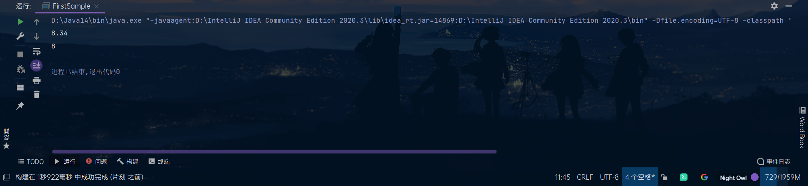
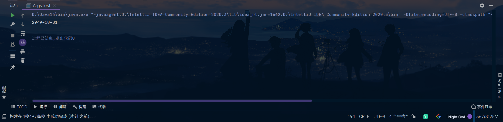
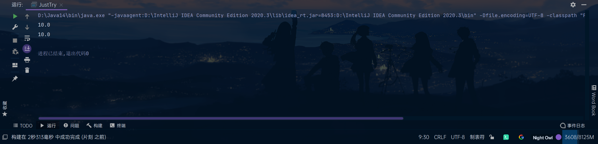

# Java学习

[toc]

# Learn 《Java核心技术 卷Ⅰ》第三章

## 一. 基本数据类型

### int

| int                       | short int     | long                                      | byte      |
| ------------------------- | ------------- | ----------------------------------------- | --------- |
| -2147483648 至 2147483647 | -32768至32767 | -9223372036854775808至9223372036854775807 | -128至127 |

### float&double

| float                 | double                           |
| --------------------- | -------------------------------- |
| 1.4E-45至3.4028235E38 | 4.9E-324至1.7976931348623157E308 |

此外，浮点型还有三个特殊值：

- 正无穷大

- 负无穷大

- NaN(It means "Not a number")

他们所对应的常量分别是：

- ```java
	Double.POSITIVE_INFINITY
	```
```

- ```java
	Double.NEGATIVE_INFINITY
```

- ```java
  Double.NaN
  ```
```

### char

字符型。似乎没什么可说的

### 注意：

长整型后缀L(For example:4000000000L)，十六进制前缀0x(For example:0xCAFE)，八进制前缀0(For example:010)

如果我想定义一个浮点型值为2，怎么办？

​```java
float a = 2;
```

这样是不规范的，因为2会被认为是整型数据，所以会进行一次类型转换，因此，应该这样写：

```java
float a = 2.0;
```

## 二.变量与常量

### 变量声明与初始化

```java
类型 变量名 = 值;
```

### 常量声明与初始化

格式与变量的相同，不过多加个关键字`final`

```java
final 类型 常量名 = 值;
```

C、C++可以使用const关键字来声明常量（C亦可使用#define），虽然Java也有保留字const，但目前并未使用，所以必须使用final关键字

### 区别

变量可以再次被赋值，如：

```java
public class HowOldAmI {

    public static void main(String[] args) 
    {
        int age = 14;
        System.out.println("I`m " + age + " years old now.");

        age = 15;
        System.out.println("Next year,I`ll be "+ age + " !");
    }
}
```

如果把第五行改成这样，使age成为常量并再次编译的话：

```java
final int age = 14;
```

Java虚拟机就会报错：


这也就是常量设计的意义，因为有些重要的东西是不能改变的（如我国的领土面积），为了防止在程序中不小心改变了它们的值，于是有了这种常量的设计

### 枚举类型

 有时，变量的取值只在一个集合内，如服装的尺寸。为了表示这些变量，我们可将尺寸编码设为S、M、L、X，但这样很容易出错，因此有了枚举类型。

比如，可以定义一个这样的枚举类型：

```java
enum Size { SMALL, MEDIUM, LARGE, EXTRA_LARGE}
```

于是，我们可以定义一个这样的变量：

```java
Size s = Size.SMALL;
```

其实也可以这样：

```java
var i = Size.MEDIUM;
```

这样可以省略左边部分的重复书写，这个在说到面向对象时再说

### 大数

由之前的知识可得，整型和浮点型的数都是有取值范围的，那如果我们的数据比这还要大，就需要用大数了

大数不是基本的数据类型，它是`java.math`下的类，可以处理任何大小数据的计算

对于普通的数，可以这样将其转成大数：

```java
BigInteger big = BigInteger.valueOf(a);  // 假设a是任意整型
```

对于更大的数，可以使用一个带字符串参数的构造器，如：

```java
BigInteger big = new BigInteger("3141592653589793238462643383279");
```

#### 大数常量

- ```java
	BigInteger.ZERO
	```
	
- ```java
	BigInteger.ONE
	```
	
- ```java
	BigInteger.TWO
	```
	
- ```java
	BigInteger.TEN
	```

#### 大数运算

大数的运算需要使用大数类中的方法，如：

```java
BigInteger a = BigInteger.valueOf(1);
BigInteger b = BigInteger.valueOf(2);
BigInteger c = a.add(b);
```

## 三.运算符

### 数值转换

比如我们需要把一个int转成float，只需这样：

```java
public class IntToFloatTest {

    public static void main(String[] args) 
    {
        int a = 1234567;

        float b = a;

        System.out.println(a);

        System.out.println(b);
    }
}
```

结果如下：


下面说下强制转换。从这个名字就看得出来，是强制的类型转换。那为啥要强制转换呢？举个例子：

> 有一个100mL的大烧杯和一个50mL的小烧杯
>
> 小烧杯无论装多少水，倒进大烧杯中总是不会溢出来
>
> 但是大烧杯向小烧杯中倒水就不一定了

类型转换也一样，int就像是那个小烧杯，float就像那个大烧杯，int转float肯定没问题，但反过来就不一定了

但有的时候就是要这样转换！所以就有了强制转换，按照书上的定义，`可能损失信息的转换要通过强制转换来完成`。丢失什么信息呢？请看下面的这个程序：

```java
public class DoubelToInt {

    public static void main(String[] args) 
    {
        double a = 8.34;

        int b = (int) a;

        System.out.println(a);

        System.out.println(b);
    }
}
```

结果如下：



原来是把小数点后的部分截掉了~如果你想用四舍五入的话，就需要用到`java.lang.Math.round`了。演示如下：

```java
import java.lang.Math;

public class DoubelToInt2 {

    public static void main(String[] args)
    {
        double a = 8.34;
        double b = 8.54;

        int c = (int) Math.round(a);

        int d = (int) Math.round(b);

        System.out.println(a);

        System.out.println(b);

        System.out.println(c);

        System.out.println(d);
    }
}
```

结果如下：


这样就可以四舍五入进行转换了

### 算数运算符

| 名称 | 用法 |  意义  |
| :--: | :--: | :--: |
| + | a+b | a与b的和 |
| - | a-b | a与b的差 |
| * | a*b | a与b的积 |
| / | a/b | a与b的商 |
| % | a%b | a与b的余数 |

#### 注意

0不能作为除数。如果一个整型与0相除，如这个：

```java
public class WhatWillHappen {

    public static void main(String[] args) 
    {
        System.out.println(5 / 0);
    }
}
```

会这样：


Java虚拟机会抛出异常`ArithmeticException`，有关异常的部分后面再说

如果让一个浮点数与0相除呢？

```java
public class WhatWillHappen2 {

    public static void main(String[] args) 
    {
        System.out.println(5.1 / 0);
    }
}
```

会这样：


它说结果是正无穷大

按照书上说，浮点数与0相除结果可能是无穷大和NaN（比如用0.0 / 0的结果就是NaN）

#### 更高级的数学运算

|  名称  |  方法  |
| :----: | ---- |
|  乘方  | pow() |
| 平方根 | sqrt() |
| 三角函数   | sin()、cos()、tan() |
| 对数和它的反函数   | exp()、log()、log10() |
| π   | PI |
| e   | E |

使用例：

```java	
import java.lang.Math;

public class MathTest {

    static int a = 4;

    public static void main(String[] args) 
    {
        System.out.println(Math.pow(a,2));

        System.out.println(Math.sqrt(a));

        System.out.println(Math.sin(a));

        System.out.println(Math.cos(a));

        System.out.println(Math.tan(a));

        System.out.println(Math.exp(a));

        System.out.println(Math.log(a));

        System.out.println(Math.log10(a));

        System.out.println(Math.PI);

        System.out.println(Math.E);
    }
}
```

输出结果如下：


如果觉得Math前缀麻烦，可以把第1行改成这样：

```java	
import static java.lang.Math.*;
```

于是你的程序可以变成这样：

```java
import java.lang.Math.*;

public class MathTest2 {

    static int a = 4;

    public static void main(String[] args) 
    {
        System.out.println(pow(a,2));

        System.out.println(sqrt(a));

        System.out.println(sin(a));

        System.out.println(cos(a));

        System.out.println(tan(a));

        System.out.println(exp(a));

        System.out.println(log(a));

        System.out.println(log10(a));

        System.out.println(PI);

        System.out.println(E);
    }
}
```

是不是方便多了？这里使用了静态导入，有关部分后面再说

### 其它数字运算符

#### 结合赋值和运算符

我们经常遇到需要给一个变量做一些计算，然后再赋给它的情况，可以这样写：

```java
a = a + 4;
```

但实际上还能更精简一些：

```java	
a += 4;
```

以上两行代码是等价的

这里值得一提的是：

```java
a += 3.5;  // 假设a为整型
```

会是什么结果？

```java
public class IDontKonwHowToNameThisClass {

    public static void main(String[] args)
    {
        int a = 2;

        a += 3.5;

        System.out.println(a);
    }
}
```


这说明什么？

说明Java实际做的运算是它：

```java	
a = (int)(a + 3.5);
```

往下推一步：

```java
a = (int)(5.5)
```

所以就有`a等于5`

其它的基本数学运算也有这种运算符：

| 基本数学运算符 | 对应的结合赋值运算符 |
| :------------: | :------------------: |
| + | += |
| - | -= |
| * | *= |
| / | /= |
| & | &= |

#### 自增、自减运算符

我们经常遇到需要给一个变量加1或减1的情况（如之后会提到的for循环），我们有三种方法使变量值加1或减1

第一种是最基础，也是最繁琐的：

```java
a = a + 1;  // 假设a是一个整型变量
```

第二个是刚刚学的：

```java
a += 1;
```

第三种是自增运算符，如下：

```java
a++;
```

是不是超简单！（不要忘了最后的分号）

### 关系和Boolean运算符

> 3等于7

看到这句话，你觉得它是对的还是错的？

肯定是*错*的嘛~

> 3小于7

这句呢？

唔。。。是*对*的呢~

就像刚刚这两个例子一样，在计算机中也会用“是”与“否”表达逻辑，在Java中，“是”就是"true"，“否”则是"false"。大部分的现在计算机语言都有这样的设计，实际上，计算机的原理就是这样的01（既真与假）来进行计算的

在Java中，逻辑运算符有`==`,`!=` `<` `>` `<=` `>=`，分别代表等于、不等于、小于、大于、小于等于、大于等于。

再看这句话

> 3小于7且3大于1

是对的吧？

再看这个

> 3大于7或3小于23

是对的还是错的呢？

”3大于7“是错的，”3小于23“的对的，中间用”或“连接，因此只需两个中一个正确就行，所以这句话是对的

”或“、”和“、”非“三种基本的判断在Java中分别表示为`||` `&&` `!` （注意要把逻辑运算符和&&、数学运算符求余&分清楚~）

它们的计算逻辑如下：

- || ：两个值至少一个为true则返回true，反之一律返回false
- &&：两个值都为true时返回true，反之一律返回false
- ！：只有一个参与运算的值，返回与它相反的值

我们通过一段程序加强理解：

```java
public class BooleanTest {

    public static void main(String[] args)
    {
        Boolean a = true;
        Boolean b = false;

        System.out.println(a || b);
        System.out.println(a && b);
        System.out.println(!a);
        System.out.println(!b);
    }
}
```

结果：


### 三元运算符

我们已经学习了如`+` `||`之类的运算符，它们都需要两个参与运算的值，这样的运算符被称为**双元运算符**

还学习了`!`，它只需要一个值参与运算，这样的被称为**一元运算符**

相同的，还有**三元运算符**

它长这样：`? :`

准确说是这样：`条件 ? 语句1 : 语句2`

它的逻辑是，如果条件为真，则走语句1，反之则走语句2

比如这段程序，可以用来返回两数中较小的数：

```java
public class IStillDontKonwHowToNameThisClass {

    public static void main(String[] args)
    {
        int a = 1;
        int b = 2;

        System.out.println(a < b ? a : b);
    }
}
```

### 位运算符

这里不是很好解释，我打算把长安成的《长安成的python之旅》中有关二进制的部分~~白嫖~~拿过来，所以只是先将这些符号列出来

`&` `|` `^` `~` `>>` `<<` `>>>`

分别代表和、或、非、左移、右移、无符号左移

### 运算优先级

跟数学差不多，不管了

## 四.字符串

在Java中，字符串是字符组成的序列，如

```java
String a = "Hello World";
```

字符串可以被拆开、拼接，以及其它奇奇怪怪的操作。Java提供了一些API去实现这些功能

### 字串

也就是把字符串拆开，使用一个叫substring的方法，下面这段程序：

```java
public class SubstringTest {

    public static void main(String[] args)
    {
        String a = "Hello World!";

        String b = a.substring(0,5);

        System.out.println(b);
    }
}
```

它会输出：


注意参数是`substring(0,5)`，两个参数分别是开始和结束的位置，Java语言从0开始计数，最后的5表示到第5个为止，但并不包括第5个

### 拼接

Java也可以把多个字符串拼起来，这个不需要奇奇怪怪的方法，只需要`+`即可

```java
public class StringTest {

    public static void main(String[] args)
    {
        String a = "Hello";
        String b = "World";

        String c = a + " " + b;

        System.out.println(c);
    }
}
```

结果如下：


还要别的比较高级的拼接方法，如`join()`方法，书上的示例：

```java
String all = String.join(" / ","S","M","L","XL");
```

打印结果：


这个方法的源码如下：

```java
/**
 * Returns a new String composed of copies of the
 * {@code CharSequence elements} joined together with a copy of
 * the specified {@code delimiter}.
 *
 * <blockquote>For example,
 * <pre>{@code
 *     String message = String.join("-", "Java", "is", "cool");
 *     // message returned is: "Java-is-cool"
 * }</pre></blockquote>
 *
 * Note that if an element is null, then {@code "null"} is added.
 *
 * @param  delimiter the delimiter that separates each element
 * @param  elements the elements to join together.
 *
 * @return a new {@code String} that is composed of the {@code elements}
 *         separated by the {@code delimiter}
 *
 * @throws NullPointerException If {@code delimiter} or {@code elements}
 *         is {@code null}
 *
 * @see java.util.StringJoiner
 * @since 1.8
 */
public static String join(CharSequence delimiter, CharSequence... elements) {
    Objects.requireNonNull(delimiter);
    Objects.requireNonNull(elements);
    // Number of elements not likely worth Arrays.stream overhead.
    StringJoiner joiner = new StringJoiner(delimiter);
    for (CharSequence cs: elements) {
        joiner.add(cs);
    }
    return joiner.toString();
}
```

可见，它是把多个字符串放在一起（即参数`CharSequence... elements`），两两之间用一个定界符分隔（即参数`CharSequence delimiter`）

<hr/>

在Java11中，还添加了`repeat()`方法，用于重复输出一个字符串

如书上的示例代码：

```java
String repeated = "Java".repeat(3);
```

会输出：


### 检测字符串是否相等

可以使用`equals()`检测两个字符串是否相等

看到这一行，你可能会问：“不能用==比较字符串吗？”

如以下示例：

```java
public class EqualsTest {

    public static void main(String[] args)
    {
        String a = "Potato Yao";
        String b = "Potato Yao";

        System.out.println(a == b);

        System.out.println(a.equals(b));
    }
}
```

结果如下：


似乎用`==`也没什么问题呢

但是再看这个：

```java
public class FirstSample {

    public static void main(String[] args)
    {
        String a = "Potato Yao";
        String b = a.substring(0,6);  // It should be "Potato"
        String c = "Potato";

        System.out.println(b == c);  // DOes it mean "Potato == Potato"?

        System.out.println(b.equals(c));  // How about it?Does it mean "Potato == Potato"?
    }
}
```

结果如下：


为什么`==`的结果是false？

这是因为，`==`运算符只是判断两个字符串是否存放在同一位置上，上例中`b`和`c`显然不在一起，因此返回false

所以比较字符串时请使用`equals()`方法

附`equals()`方法源码：

```java
/**
* Compares this string to the specified object.  The result is {@code
* true} if and only if the argument is not {@code null} and is a {@code
* String} object that represents the same sequence of characters as this
* object.
*
* <p>For finer-grained String comparison, refer to
* {@link java.text.Collator}.
*
* @param  anObject
*         The object to compare this {@code String} against
*
* @return  {@code true} if the given object represents a {@code String}
*          equivalent to this string, {@code false} otherwise
*
* @see  #compareTo(String)
* @see  #equalsIgnoreCase(String)
*/
public boolean equals(Object anObject) {
    if (this == anObject) {
        return true;
    }
    if (anObject instanceof String) {
        String aString = (String)anObject;
        if (!COMPACT_STRINGS || this.coder == aString.coder) {
            return StringLatin1.equals(value, aString.value);
        }
    }
    return false;
}
```

### 空串与Null串

空串是长度为0的字符串，如下面这个：

```java
String a = "";
```

Null串是值为Null的字符串，如下面这个：

```java
String b = null;
```

要检查一个字符串是否是空串，只需：

```java
System.out.println(str.length());  // str指需检查的字符串
```

要检查一个字符串是否是Null串，只需：

```java
System.out.println(str == null;  // str指需检查的字符串
```

观察下面的代码示例：

```java
public class FirstSample {

    public static void main(String[] args)
    {
        String a = "";  // 空串
        String b = null;  // Null串

        System.out.println(a.length());

        System.out.println(a == null);

        System.out.println(b.length());

        System.out.println(b == null);

        System.out.println(a.length() == 0 && a == null);

        System.out.println(b.length() == 0 && b == null);
    }
}
```

运行如下：


我们发现，在执行`System.out.println(b.length());`时。报错了，虚拟机停止了程序，报了空指针异常`NullPointerException`，我们把12行和18行（因为18行也有`b.length()`操作）删了重试：


由此可见：

- 不能对Null串执行`length()`，会报空指针错误

- 空串与Null是不同的，空串是长度为0的字符串，它的串长度为0，内容为空；而Null串没有任何值

### 创建字符串

每当我们拼接字符串时，Java虚拟机所作的工作实际上是创建了一个新的字符串，对于简单的程序来说无所谓，但是一旦项目规模较大时，这种方法会变得耗时且浪费空间。使用`StringBuilder`可以避免问题的发生

如此创建一个空的字符串构建器：

```java
StringBuilder builder = new StringBuilder();
```

这样向其中添加内容：

```java
builder.append(str);  // str为要加入的内容
```

## 五.String API

放在`API.md`里了

## 六.输入与输出

### 常用API

出于时间原因，直接用一个代码示例展示：

Fuck,代码出了个空指针异常死活解决不了，先把程序放到这，有时间了再改吧

```java
public class WTF 
{

    public static void main(String[] args)
    {
        Scanner getUserName = new Scanner(System.in);
        System.out.println("请输入用户名：");
        String username = getUserName.nextLine();

        Console getUserPassword = System.console();
        char[] userPassword = getUserPassword.readPassword("请输入密码：","");  // 推荐使用字符数组保存密码数据
    }
}
```

### 格式化输出

使用`System.out.printf()`方法，具体转换符与C一样，故不赘述

### 文件输入与输出

#### 输入

读取文件需要创建一个Scanner对象，如下：

```java
Scanner in = new Scanner(Path.of(first), StandardCharsets.UTF_8);  // first是文件名
```

推荐的方法是加一个`try`语句环绕（后面会讲到），如下：

```java
try 
{
    Scanner in = new Scanner(Path.of(first), StandardCharsets.UTF_8);
} catch (IOException e)
{
    e.printStackTrace();
}
```

#### 输出

写入文件需要一个`PrintWriter`对象

```java
PrintWriter out = new PrintWriter(file, StandrdCharsets.UTF_8);
```

## 七.控制流程

### 块作用域

按照书上的定义，`块是指由若干条Java语句组成的语句，并用一对大括号括起来`，块确定了变量的作用域。一个块可以嵌套在另一个块中，与下图中的代码示例：

```Java
public static void main(String[] args) 
{
    int n;
    // Do something...
    {
        int k;
        // Do something...
    }
}
```

但是不可能这样：

```Java
public static void main(String[] args) 
{
    int n;
    // Do something...
    {
        int n;
        int k;
        // Do something...
    }
}
```

因为不能在嵌套的块中声明同名的语句

### 条件语句

条件语句的格式为：

```java
if (条件) 
    执行语句
```

如：

```java
if (a > 0) 
    System.out.println("a是正数");  // a是整型
```

但这样只能处理一行，为了方便且直观，推荐使用复合语句（也就是块）：

```java
if (a > 0) 
{
    System.out.println("a是正数");
}
```

如果我们想判断大于、小于或等于0，怎么写呢？

这样吗？

```java
import java.util.Scanner;


public class IfTest
{

    public static void main(String[] args) 
    {
        Scanner s = new Scanner(System.in);
        System.out.println("输入一个整数");
        int a = s.nextInt();
        if (a > 0) 
        {
            System.out.println("a大于0");
        }
        if (a == 0)
        {
            System.out.println("a等于0");
        }
        if (a < 0)
        {
            System.out.println("a小于0");
        }
    }
}
```

是不是有点麻烦了？

这里介绍一个新的操作符`else`，它意为其它，这用一段程序就很好理解了：

```java
import java.util.Scanner;


public class IfTest2
{

    public static void main(String[] args)
    {
        Scanner s = new Scanner(System.in);
        System.out.println("输入一个整数");
        int a = s.nextInt();
        if (a > 0)
        {
            System.out.println("a大于0");
        }
        else if (a == 0)
        {
            System.out.println("a等于0");
        }
        else
        {
            System.out.println("a小于0");
        }
    }
}
```

这样的写法使代码阅读性更高，也更简洁

我想到一个《C Primer Plus》中提到的例子，这是一个很容易犯的错误：

```java
public class WTFIsIt
{

    public static void main(String[] args)
    {
        int number;

        if (number > 6)
            if (number < 12)
                System.out.println("You`re close!");
        else
            System.out.println("Sorry, you lose a turn!");
    }
}
```

这是《C Primer Plus》原书中的一个例子，我把它翻译成了Java语言，如上

请问，何时打印`Sorry, you lose a turn!`？是当number小于或等于6时，还是number大于12时？换言之，else与第一个if还是第二个if匹配？答案是，else与第二个if匹配。也就是说，输入的数字和匹配相应如下：

| 数字 |          响应           |
| :--: | :---------------------: |
|  5   |          None           |
|  10  |      You`re close!      |
|  15  | Sorry, you lose a turn! |

从上一代码示例至此的部分摘自《C Primer Plus》第六版，人民邮电出版社

所以我们发现，在没有大括号的情况下，else与最近的if匹配

Wait...what?markdown里可以插入emoji？ :sweet_potato: :honeybee: （土豆和黄蜂）

### 不确定循环

循环语句格式如下：

```java
while (条件) 
    执行语句
```

如果条件为true，则会一直执行执行语句，反之，如果是false，则不执行执行语句

或者写成块状：

```java
while (条件) 
{
    执行语句
}
```

还有一种循环结构：

```java
do
{
    执行语句
}
while (条件);
```

这种`while`和`do...while`的区别是`while`先判断再执行，`do...while`先执行再判断

感觉`do...while`有点鸡肋？下下下节就揭晓它的用处！

由于这种循环的次数是不确定的，因此称做*不确定循环*

### 确定循环

上一节提到了不确定循环，这节是确定循环，它的循环次数是确定的

它的结构如下：

```java
for (int i = 0; i < 次数; i++)
{
    执行语句
}
```

请注意变量`i`是在循环内声明的

还有一种确定循环，叫`for each`循环，这种循环用于数组，关于数组的内容后面再说，这里先介绍这种循环

如：

```java
public class ForEachTest
{

    public static void main(String[] args)
    {
        int[] a = {1,2,3,4,5,6,7,8};
        
        for (int i : a)
        {
            System.out.println(i);
        }
    }
}
```

输出结果如下：


这种循环可以用普通`for`实现，不过比较麻烦，上面程序第8行的等价代码：

```java
for (int i = 0; i < a.length; i++)
```

### 多重选择

在处理很多选项时，可以使用`if..else if...else`语句，也可以使用`switch`，如下：

```java
switch (选项)
{
    case 条件1:
        // do sth.
        break;
    case 条件2:
        // also do sth.
        break;
    // 其它条件
    default:
        // 当以上都不符合要求时
        // do sth
        break;
}
```

如：

```java
public class HelloWorld
{

    public static void main(String[] args)
    {
        int i = 1;

        switch (i)
        {
            case 1:  // 这里的1实际意为 if (i == 1) ，同下
                System.out.println("你的位置在1号");
                break;
            case 2:
                System.out.println("你的位置在2号");
                break;
            case 3:
                System.out.println("你的位置在3号");
                break;
            case 4:
                System.out.println("你的位置在4号");
                break;
            case 5:
                System.out.println("你的位置在5号");
                break;
            default:
                System.out.println("这里没有你的位置！");
                break;
        }
    }
}
```

case标签可以是：

- 类型为`char`、`byte`、`short`或`int`的常量表达式
- 枚举常量
- 字符串字面量（since Java7）

### 中断控制流程的语句

除了让条件变成`false`以外，我们还能怎么退出循环呢？

答案是，`break`和`continue`

这俩有些不同，先举个`break`的例子：

```java
public class BreakTest
{

    public static void main(String[] args)
    {
        for (int i = 0; i < 10; i++) {
            System.out.println("Hello "+ i);
            break;
        }
    }
}
```

结果：


可见，`break`直接退出了循环

`break`一般常用于`while`语句

然后是`continue`

```java
public class ContinueTest
{

    public static void main(String[] args)
    {
        for (int i = 0; i < 10; i++) {
            if (i % 2 == 0)
            {
                System.out.println("Hello" + i);
            }
            else
            {
                continue;
            }
        }
    }
}
```

结果：


由上可见，**`break`直接退出循环，`continue`只退出一次**

<hr/>

C、C++等语言中有一种叫`goto`的语句，Java语言的设计者觉得这玩意太恶心人，所以把它设计为一个保留字但并未使用

但是呢，有时用它直接跳出一大串循环确实很方便

所以Java就有了`带标签的break`语句

如下所示的代码：

```java
public class BreakTest2
{

    public static void main(String[] args)
    {
        int i = 1;

        flag:
        while (true)
        {
            System.out.println("I am here.");
            if (i > 0)
            {
                break flag;
            }
        }
    }
}
```

只输出了一次`I am here.`


厉害不？我们再多套几层：

```java
public class BreakTest3
{

    public static void main(String[] args)
    {
        int i = 1;
        int k = -1;

        flag:
        while (true)
        {
            System.out.println("I am here");
            for (int a = 0; a < 10; a++)
            {
                System.out.println("Now I am here");
                if (i > 0)
                {
                    System.out.println("I was there just now");
                    if (k < 0)
                    {
                        System.out.println("Now I an here");
                        break flag;
                    }
                }
            }
        }
    }
}
```

也退出来了呢


是不是超棒！

不过要注意的是，`带标签的break`只能用于跳出，而不能用于跳入

实际上，只有一个`while`内有跳出语句的`带标签的break`，与`do...while`是等价的

## 八.数组

数组是储存相同类型值的序列

### 数组的声明和初始化

数组的声明如下：

```java
数据类型[] 数组名
```

初始化后，需要初始化：

```java
数组名 = new int[数组长度]
```

或者比较方便的：

```java
数据类型[] 数组名 = {元素}
```

### 访问数组中的元素

数组的第一个元素位置为***0***，注意不是1

这就是之前提到`for each`循环时以0开始的原因

### 数据拷贝

如下代码所示：

```java
public class JustTest
{

    public static void main(String[] args)
    {
        int[] smallPrimers = {1,2,3,4,5,6,7,8,9};

        int[] luckyNumbers = smallPrimers;

        for (int i : smallPrimers)
        {
            System.out.print(i);
        }
        System.out.println("\n");
        for (int i : luckyNumbers)
        {
            System.out.print(i);
        }

        luckyNumbers[5] = 12;

        System.out.println("\n");

        for (int i : smallPrimers)
        {
            System.out.print(i);
        }
        System.out.println("\n");
        for (int i : luckyNumbers)
        {
            System.out.print(i);
        }
    }
}
```

结果如下：


可见，不仅改变了`luckyNumbers`数组的值，还改变了`luckyNumbers`的值

这是因为`luckyNumbers`实际上是`luckyNumbers`的副本，它们自然是一起改变的

<hr>

如果想拷贝的是整个数组，就需要`copyOf`方法了：

```java
int[] copiedLuckyNumbers = Arrays.copyOf(luckyNumbers, luckyNumbers.length);
```

第一个参数是要复制的数组，第二个是新数组的长度

假如我这里复制后的数组比数值的数组还要长会咋样？比如这个：

```java
int[] copiedLuckyNumbers = Arrays.copyOf(luckyNumbers, luckyNumbers.length + 1);
```

这样的话，多的部分会变成默认值（整型0，浮点型0.0，布尔型false，其它null）

如果复制后的数组比数值的数组短呢？

```java
int[] copiedLuckyNumbers = Arrays.copyOf(luckyNumbers, luckyNumbers.length - 1);
```

这样的话，只会复制前面的值

### 命令行参数

有的时候我们输入一些命令，需要提供参数，如

```shell
javadoc -encoding UTF-8 Hello.java
```

 参数是怎么实现的呢？

实际上，`main(String[] args)`方法中的`args`数组就是参数

如：

```java
public class ArgsTest
{

    public static void main(String[] args) 
    {
        System.out.println(args[0]);
    }
}
```

如果在命令行运行这个程序并输入一个参数：

草，出事了，报错`错误: 找不到或无法加载主类`，目前找不到问题所在，先跳过

### 数组排序

可以使用`Arrays`类中的`sort()`方法对数组排序，如：

```java
import java.util.Arrays;

public class SortTest
{

    public static void main(String[] args)
    {
        int[] a = {2,1,5,4,3};
        for (int i : a)
        {
            System.out.print(i);
        }
        System.out.println("\n");
        Arrays.sort(a);
        for (int i :a)
        {
            System.out.print(i);
        }
    }
}
```

结果：


### 多维数组

我们平时所遇到的问题不仅限于1维，有时需要多维运算，因此有了多维数组，实际上，多维数组就是由数组组成的数组

声明二维数组如下：

```java
数据类型[][] 数组名 = {
    {元素,...},
    {元素,...},
    其它行...
}
```

更高维数组声明方法相同

---
数组也可能是不规则的，无所谓~

#  Learn《Java核心技术 卷Ⅰ》第四章

## 一.使用预定义类

### 对象与对象变量

在Java语言中，需要使用构造器构造新的示例

构造器的名字应该与类名相同，如`Date`类的构造器名为`Date`，如果要构建一个`Date`的对象，则需加上`new`操作符，如：

```java
new Date();
```

可以把对象传给一个方法：

```java
System.out.println(new Date());
```

也可以对对象应用一个方法：

```java
String s = new Date().toString();
```

如果需要一个构造的对象多次使用，可以将对象存放在一个变量中：

```java
Date d = new Date();
```

### Java类库中的`LocalDate`类

相对`Date()`来说，更推荐用这个

<hr/>

我们可以用*静态工厂方法*给它创建一个对象，如：

```java
LocalDate.now()
```

也可以提供具体的年月日构造一个特定日期的对象：

```java
LocalDate.of(2021, 1, 12)
```

一般我们喜欢把它存到一个变量里：

```java
LocalDate nationalDay = LocalDate.of(1949, 10, 1);
```

一旦有了对象，就可以调用它的方法：

```java
public class LocalDateTest
{

    public static void main(String[] args)
    {
        LocalDate nationalDay = LocalDate.of(1949, 10, 1);

        System.out.println(nationalDay.getYear());
        System.out.println(nationalDay.getMonthValue());
        System.out.println(nationalDay.getDayOfMonth());
    }
}
```

结果如下：



当然了，这里的国庆节指的是中国的，我还没有把这玩意国际化的准备

<hr/>

还有一个好玩的，`plusDays()`方法、`plusMouths()`和`plusYears()`，它的作用是生成一个距离当前指定天数的新日期，如：

```java
import java.time.LocalDate;

public class ArgsTest
{

    public static void main(String[] args)
    {
        LocalDate nationalDay = LocalDate.of(1949, 10, 1);

        LocalDate the2949thNationalDay = nationalDay.plusYears(1000);
        
        System.out.println(the2949thNationalDay);
    }
}
```

这里只是举个例子，一般不建议去这么长的变量名

### 更改器方法与访问器方法

回顾上一节最后的那个例子：

```java
LocalDate the2949thNationalDay = nationalDay.plusYears(1000);
```

此时`nationalDay`变量会有啥变化？

我们在上一个程序后再加一行：

```java
System.out.println(nationDay)
```

会有如下结果：


我们发现原来的变量没被改变

像这样，`只访问对象而不修改对象的方法被称为访问器方法`

在以前的Java类库中，有一个处理日历的类`GregorianCalendar`，我们如果用这个再试试：

```java
import java.util.Calendar;
import java.util.GregorianCalendar;

public class ArgsTest
{

    public static void main(String[] args)
    {
        GregorianCalendar someDay = new GregorianCalendar(2999, 12, 31);

        System.out.println(someDay.get(Calendar.YEAR));
    }
}
```

结果：


如果加一行，变成这样：

```java
import java.util.Calendar;
import java.util.GregorianCalendar;

public class ArgsTest
{

    public static void main(String[] args)
    {
        GregorianCalendar someDay = new GregorianCalendar(2999, 12, 31);

        System.out.println(someDay.get(Calendar.YEAR));

        someDay.add(Calendar.YEAR,1000);

        System.out.println(someDay.get(Calendar.YEAR));
    }
}
```

就会：


这种方法会修改对象，所以被称作***更改器方法***

## 二.用户自定义类

在Java中，最简单的类定义形式为：

```java
class ClassName
{
    field1
    field2
    // and so on.
    constructor1
    constructor2
    // and so on.
    method1
    method2
    // and so on.
}
```

以上内容的数量和顺序都无所谓

### 代码示例及介绍

书上有一个代码示例，是一个叫`Employee`的类（你会爱上这个类的，因为整本书的面向对象都是拿它为基础举例子），如下：

```java
import java.time.LocalDate;

/**
 * @author 碳烤黄蜂
 */

public class Employee
{
   private String name;
   private double salary;
   private LocalDate hireDay;

   public Employee(String n, double s, int year, int mouth, int day)
   {
      name = n;
      salary = s;
      hireDay = LocalDate.of(year, mouth, day);
   }
   public String getName()
   {
      return name;
   }

   public double getSalary()
   {
      return salary;
   }

   public LocalDate getHireDay()
   {
      return hireDay;
   }

   public void raiseSalary(double byPercent)
   {
      double raise = salary * byPercent / 100;
      salary += raise;
   }
}
```

然后是测试类：

```java
/**
 * @author 碳烤黄蜂
 */

public class EmployeeTest
{
   public static void main(String[] args)
   {
      Employee[] staff = new Employee[3];

      staff[0] = new Employee("Yue Xiaofeng", 80000, 2006, 1, 26);  // 请原谅我把你的生日忘了，虽然问出来了
      staff[1] = new Employee("Potato Yao", 80000, 2006, 2, 19);  // 然而我还记得自己的。。。
      staff[2] = new Employee("Bee Wang", 80000, 2005, 8, 15);  // 不知道蜂的英语名是什么呢，(* ￣︿￣)

      for (Employee e : staff)
      {
         e.raiseSalary(5);
      }

      for (Employee e : staff)
      {
         System.out.println("name=" + e.getName() + ",salary=" + e.getSalary() + ",hireDay=" + e.getHireDay());
      }
   }
}
```

<hr/>

下面做解析：

`Employee`中包含一个构造器和四个方法，如下：

```java
public Employee(String n, double s, int year, int mouth, int day)
```

```java
public String getName()
```

```java
public double getSalary()
```

```java
public LocalDate getHireDay()
```

```java
public void raiseSalary(double byPercent)
```

还有三个字段用于存放数据：

```java
private String name;
```

```java
private double salary;
```

```java
private LocalDate hireDay;
```

请注意它们的权限修饰符

#### 从构造器开始

```java
public Employee(String n, double s, int year, int mouth, int day)
{
   name = n;
   salary = s;
   hireDay = LocalDate.of(year, mouth, day);
}
```

这段没啥可说的，一个很基本的构造器。test文件中可以看到它的实际使用：

```java
Employee[] staff = new Employee[3];

staff[0] = new Employee("Yue Xiaofeng", 80000, 2006, 1, 26);  // 请原谅我把你的生日忘了，虽然问出来了
staff[1] = new Employee("Potato Yao", 80000, 2006, 2, 19);  // 然而我还记得自己的。。。
staff[2] = new Employee("Bee Wang", 80000, 2005, 8, 15);  // 不知道蜂的英语名是什么呢，(* ￣︿￣)
```

这里记住几个东西：

- 构造器与类同名
- 每个类可以有一个以上的构造器
- 构造器参数数量无所谓
- 构造器没有返回值
- 构造器总是伴随`new`操作符一起调用

#### 用`var`声明局部变量

在C#中，有一个神奇的操作符叫`var`，它可以让编译器自己推变量的类型，非常方便。现在Java也有这玩意了

如：

```java
Employee harry = new Employee("Harry Hacker", 50000, 1989, 10, 1);
```

可以写成这样：

```java
var harry = new Employee("Harry Hacker", 50000, 1989, 10, 1);
```

这样代码会变得更加优雅

请注意这个关键字只能用于*方法中的局部变量*

#### null引用的解决方法

有两种方法解决null引用问题

<dl>
    <dt>宽容型</dt>
    <dd>把一个null参数转换为非null值</dd>
    <dd>如：</dd>
    <dd><code class="java">if (n == null) name = "unknown"; else name = n;</code></dd>
    <dt>严格型</dt>
    <dd>直接拒绝null参数</dd>
    <dd><code>public Employee(String n, double s, int year, int mouth, int day)<br>
	{<br>
		Objects.requireNonNull(n, "The name cannot be null");<br>
		name = n;<br>
	    // So on.<br>
    }
	</code></dd>
</dl>

第二种比较好，它能提供问题的描述，还可以指明问题所在的位置

#### 隐式参数与显示参数

假如我们有这么一个调用：

```java
number007.raiseSalary(5);
```

它将会执行什么？

是它：

```java
double raise = number007.salary * (5 / 100);
number007.salary += raise;
```

所以说第一个参数是隐式参数，第二个是显式参数

在Java中，用`this`关键字指示隐式参数，所以`raiseSalary(double byPercent)`可以写成这样：

```java
double raise = this.salary * byPercent / 100;
this.salary += raise;
```

不过用处不大的样子呢

#### 封装的优点

回顾示例中出现的访问器方法：

```java
public String getName()
{
	return name;
}

public double getSalary()
{
	return salary;
}

public LocalDate getHireDay()
{
	return hireDay;
}
```

这样的话，只有调用这些公共方法才能修改私密变量：

```java
private String name;
private double salary;
private LocalDate hireDay;
```

这样就避免了其它类不小心更改了它们

#### 基于类的访问权限、私有方法、final实例字段

没啥可说的

私有方法把权限修饰符`public`改成`private`

final实例字段是在类的定义前加`final`关键字，这样就没法动它了

莫得意思，我们继续

## 三.静态字段和静态方法

### 静态字段

如果一个字段定义为`static`，那么每个类就都只有一个这样的字段，举个例子：

```java
class Employee
{
	private static int nextId = 1;
	private int id;
	// So on;
}
```

因为标识码是一人一个，所以这里用了`static`

假如有这样一个方法：
```java
public void setId()
{
	id = nextId;
	nextId++;
}
```

执行：
```java
harry.setId();
```

相当于执行了：
```java
harry.id = Employee.nextId;
Employee.nextId++;
```

### 静态常量

Math类中有一个常量`PI`，它是这样定义的：

```java
public static final double PI = 3.14159265358979323846;
```

为啥要有`static`关键字呢？

如果没有它，那么`PI`就成了`Math`中的一个示例，因此，需要用`Math`类的一个对象访问`PI`，而且每个`Math`都有`PI`的副本，所以要用`PI`就得这样：

```java
Math m = new Math();
System.out.println(n.PI);
```

蛮智障的，不是吗

### 静态方法

静态方法是不在对象上执行的方法，比如之前`Math`类中的那些：

`public static double cos(double a)`

`public static double tan(double a)`

And so on.

我们用它们的时候，是这样的：

```java
import java.lang.Math;

public class MathTest
{
	public static void main(String[] args)
	{
		System.out.println(Math.cos(3));
		System.out.println(Math.tan(3));
		// And so on;
	}
}
```

而不是：

```java
import java.lang.Math;

public class MathTest
{
	public static void main(String[] args)
	{
		Math m = new Math();
		System.out.println(m.cos(3));
		System.out.println(m.tan(3));
		// And so on;
	}
}
```

可见，它在计算过程中没有`Math`对象，也就是说，它没有隐式参数

按照书上的说法，在以下两种情况使用静态方法：

- 方法不需要访问对象状态，因为它需要的所以参数都通过显式参数提供

- 方法只需要访问类的静态字段

### 工厂方法

回忆`LocalDate`类的`LocalDate.now`方法，它没有使用构造器，为啥呢？

- 无法命名构造器，构造器的名字应该和类名相同，但是这里有两个名字

- 使用构造器时，无法改变构造对象的类型

书上就说了这点，是不一脸懵逼？

于是我去查了廖雪峰大佬的网站

到`main`方法之前，引自`https://www.liaoxuefeng.com/wiki/1252599548343744/1281319170474017`

> 工厂方法的目的是使得创建对象和使用对象是分离的，并且客户端总是引用抽象工厂和抽象产品

我们以具体的例子来说：假设我们希望实现一个解析字符串到Number的Factory，可以定义如下：

```java
public interface NumberFactory {
    Number parse(String s);
}
```

有了工厂接口，再编写一个工厂的实现类：

```java
public class NumberFactoryImpl implements NumberFactory {
    public Number parse(String s) {
        return new BigDecimal(s);
    }
}
```

而产品接口是Number，NumberFactoryImpl返回的实际产品是BigDecimal。

那么客户端如何创建NumberFactoryImpl呢？通常我们会在接口Factory中定义一个静态方法getFactory()来返回真正的子类：

```java
public interface NumberFactory {
    // 创建方法:
    Number parse(String s);

    // 获取工厂实例:
    static NumberFactory getFactory() {
        return impl;
    }

    static NumberFactory impl = new NumberFactoryImpl();
}
```

在客户端中，我们只需要和工厂接口NumberFactory以及抽象产品Number打交道：

```java
NumberFactory factory = NumberFactory.getFactory();
Number result = factory.parse("123.456");
```

调用方可以完全忽略真正的工厂NumberFactoryImpl和实际的产品BigDecimal，这样做的好处是允许创建产品的代码独立地变换，而不会影响到调用方。

有的童鞋会问：一个简单的parse()需要写这么复杂的工厂吗？实际上大多数情况下我们并不需要抽象工厂，而是通过静态方法直接返回产品，即：

```java
public class NumberFactory {
    public static Number parse(String s) {
        return new BigDecimal(s);
    }
}
```

这种简化的使用静态方法创建产品的方式称为静态工厂方法（Static Factory Method）。静态工厂方法广泛地应用在Java标准库中。例如：

`nteger n = Integer.valueOf(100);`

Integer既是产品又是静态工厂。它提供了静态方法valueOf()来创建Integer。那么这种方式和直接写new Integer(100)有何区别呢？我们观察valueOf()方法：

```java
public final class Integer {
    public static Integer valueOf(int i) {
        if (i >= IntegerCache.low && i <= IntegerCache.high)
            return IntegerCache.cache[i + (-IntegerCache.low)];
        return new Integer(i);
    }
    ...
}
```

它的好处在于，valueOf()内部可能会使用new创建一个新的Integer实例，但也可能直接返回一个缓存的Integer实例。对于调用方来说，没必要知道Integer创建的细节。

>  工厂方法可以隐藏创建产品的细节，且不一定每次都会真正创建产品，完全可以返回缓存的产品，从而提升速度并减少内存消耗。

如果调用方直接使用Integer n = new Integer(100)，那么就失去了使用缓存优化的可能性。

我们经常使用的另一个静态工厂方法是List.of()：

`List<String> list = List.of("A", "B", "C");`

这个静态工厂方法接收可变参数，然后返回List接口。需要注意的是，调用方获取的产品总是List接口，而且并不关心它的实际类型。即使调用方知道List产品的实际类型是java.util.ImmutableCollections$ListN，也不要去强制转型为子类，因为静态工厂方法List.of()保证返回List，但也完全可以修改为返回java.util.ArrayList。这就是里氏替换原则：返回实现接口的任意子类都可以满足该方法的要求，且不影响调用方。

和List.of()类似，我们使用MessageDigest时，为了创建某个摘要算法，总是使用静态工厂方法getInstance(String)：

```java
MessageDigest md5 = MessageDigest.getInstance("MD5");
MessageDigest sha1 = MessageDigest.getInstance("SHA-1");
```

调用方通过产品名称获得产品实例，不但调用简单，而且获得的引用仍然是MessageDigest这个抽象类。

### `main`方法

这玩意我们可太熟了

```java
public static void main(String[] args)
{
    // Some code
}
```

在很多语言中，`main`是有返回值的（如C），我们后期可以说说为什么`main`方法没有返回值

附上C语言的`main`方法：

```C
int main(void)
{
    // some code
}
```

### 方法参数

Java采用按值调用，即方法得到的是所有参数值的一个*副本*，改变的参数的这个副本，是无法改变参数的，也就是说，下面这段程序并无什么用：

```java
// It doesn`t work!
public static void tripleValue(double x)
{
	x *= 3;
}
```

我们写段程序来验证：

```java
public class MethodTest
{
	public static void main(String[] args)
	{
		double percent = 10;
		
		System.out.println(percent);
		
		tripleValue(percent);
		
		System.out.println(percent);
	}

	public static void tripleValue(double x)
	{
		x *= 3;
	}
}
```

结果如下：



那应该怎么改变变量的值呢？

答案是将`对象引用作为参数`

如这段程序：

```java
import java.time.LocalDate;
import java.util.Objects;

/**
 * @author 碳烤黄蜂
 */

public class Employee
{
	public static void main(String[] args)
	{
		var potato = new Employee("Potato Yao",100000,2006,2,19);

		System.out.println(potato.getSalary());

		tripleSalary(potato);

		System.out.println(potato.getSalary());
	}

	private String name;
	private double salary;
	private LocalDate hireDay;

	public Employee(String n, double s, int year, int mouth, int day)
	{
		Objects.requireNonNull(n, "The name cannot be null");
		name = n;
		salary = s;
		hireDay = LocalDate.of(year, mouth, day);
	}
	public String getName()
	{
		return name;
	}

	// Other getter

	public void raiseSalary(double byPercent)
	{
		double raise = salary * byPercent / 100;
		salary += raise;
	}

	public static void tripleSalary(Employee x)
	{
		x.raiseSalary(200);
	}
}
```

结果如下：


这次就成功了呢

由上可见：

- 方法*不能*修改基本数据类型的参数

- 方法*可以*改变对象参数的*状态*

- 方法*不能*让一个对象参数引用一个新的对象

## 四.对象构造

### 重载

一些类有多个构造器，比如：

这样构造一个空的`StringBuilder`对象：

`var massage = new StringBuilder();`

也可以指定一个字符串：

`var todoList = new StringBuilder("To do:\n");`

这样的功能叫重载

### 调用另一个构造器

关键字`this`指示一个方法的隐式参数，不过

如果构造器的第一个语句形如`this(...)`，说明这个构造器将要调用同一个类的另一个构造器，比如：

```java
public Employee(double s)
{
	this("Employee #" + nextId, s);  // Calls Employee(String, double)
	nextId++;
}
```

### 初始化块

之前已经说过两种初始化数据字段的方法：

- 在构造器中设置值，如：

```java
public class Test
{
	private String a;
	private int b;
	
	public Test()
	{
		a = "Hello";
		b = 43;
	}
}
```

- 在声明中赋值，如：

```java
public class Test
{
	private String a = "Hello";
	private int b = 43;
}
```

这里介绍第三种，`初始化块`

一个类的声明中可以包含任意多个代码块，只要构造这些类的对象就会执行这些代码块，比如：

```java
public class Employee
{
	private static int nextId;

	private int id;
	private String name;
	private double salary;

	/**
	 * @deprecated 这就是初始化块
	 */
	{
		id = nextId;
		nextId++;
	}

	/**
	 * @deprecated 初始化
	 */
	public Employee()
	{
		name = "";
		salary = 0;
	}
	
	public Employee(String n, double s)
	{
		name = n;
		salary = s;
	}
}
```

在这段程序中，无论用哪个构造器，都会先执行初始化块

也可以标记成静态的：
```java
static
{
	// Do something
}
```

## 五.包

包将类组织在一个集合中，方便了代码的管理

### 包名

一般是把自己官网的名字反过来，假如你的网站叫`potato.com`，那么你的包名就应该是：

`com.potato`

要注意的是，Java编译器会认为嵌套的包之间没有任何关系，比如`java.util`和`java.util.jar`完全莫得关系

### 包的导入

要使用其它包中的类，就得把它到入进来

像这样可以创建一个`LocalDate`类的对象：

```java
java.time.LocalDate today = java.time.LocalDate.now();
```

这样写，是不是太麻烦了？而且有失代码的整洁性

所以可以使用`import`语句导入包，然后就可以直接用了，像这样：

```java
import java.time.*;
```

然后就可以：

```java
LocalDate today = LocalDate.now();
```

不过那个导入语句这可以这样：

```java
import java.time.LocalDate;
```
我们知道，`*`在计算机世界中代表一切文件（补充：`?`代表一个文件），但是奇奇怪怪的是，`import java.time.*;`只能导入一个文件，要注意这个。

另外，假如你导入了这两个包：

```java
import java.util.*;
import java.sql.*;
```

此时再这样：

```java
Date today;
```

就会报错：

`ERROR--java.util.Date or java.sql.Date?`

同样的错误存在于任何导入的包中有重名的方法的情况

咋办呢

可以这样：

```java
var deadLine = new java.util.Date();
var today = new java.sql.Date(...);
```

就解决了~

### 静态导入

这样像这样写`import`语句，导入静态方法和静态字段，而不只是类：

```java
import static java.lang.System.*;
```

于是就可以：

```java
out.println("No hello world");
```

上面这句就等价于：

```java
System.out.println("No hello world");
```

也许在这里体现不出它的实用性，那我们回忆第三章说`Math`类的时候，是不是就用到这玩意了，而且确实简单了许多

### 在包中增加类

一般我们用IDEA的话就不需要考虑这个问题了，因为它会自己改好配置文件，不过还是学下比较好

首先是要在类的开头写上`package`语句，举个例子：

> 你的包名字叫`com.potato`

> 下面有这个目录`com/potato/test`

> 你在这个目录下添加文件`Test.java`

那么，你在这个`Test.java`类的第一行要添加这个语句：

```java
package com.potato.test;
```

这样才能说明这个类的位置，如果没有这个语句，那么它就是一个*无名包*

## 六.Jar文件

Jar文件可以将一个类打包起来，使其易于管理和传播

*这玩意如果你是用IDEA，那么跳过也无所谓，但如果是像我一样IDE玩腻了，开始玩编辑器和命令行，那么这一节就相当重要了*

其实这玩意你可能已经见过了

就是它：


没错，我的世界的就是通过一个jar包给你的

这也是玩电脑版我的世界需要配置Java的原因

### 创建Jar文件

使用`jar`工具创建Jar文件，格式如下：

```shell
jar [options] (jarFileName) (file1) (file2) ...
```

创建Jar包的指令是`cvf`

具体选项列表见书上P143（之后有时间了补上）

### 清单文件

Jar文件内有一个清单文件来描述文件的特殊特性，它被命名为`MANIFEST.MF`,包含于`META-INF`目录中

创建`MANIFEST.MF`文件的方法还是用`jar`工具，不过参数是`cfm`

请注意清单文件的最后一行应该是一个换行符，否则会报错

### 可执行的Jar文件

使用参数`cvfe`，第一个`.java`文件就是程序的入口

### 多版本的Jar文件

我们可以创建适用于不同Java版本的JAR文件

是放在`META-INF`目录中的一个叫`version`的目录里

添加多版本文件使用`--release`标记

## 七.文档注释

> Javadoc是由源代码文件生成的HTML文件，它能清晰地解释一个类、方法的作用，

Javadoc可以分为三种：

1. 类注释
2. 方法注释
3. 字段注释
4. 包注释

在讲这三种Javadoc之前，我们先说一些基本知识

### 格式

Javadoc抽取以`/**`开头，以`*/`结尾的注释中的信息，不过仅限于：

- 模块
- 包
- 公共类和接口
- 公共的和受保护的字段
- 公共的和受保护的构造器及方法

在`/**`和`*/`之间插入我们需要写的东西，以`@`开头，如`@author`，`@since`等，在一些这样的标记中，也可以使用HTML修饰符，如`<em>`和`</em>`、`<strong>`和`</strong>`等

### 类注释

类注释必须放在`import`语句之后，类定义之前。如下：

```java
import java.lang.String;

/**
 * 这个类的用途不是打印<em>Hello World</em>
 */

public class HelloWorld
{

    public static void main(String[] args)
    {
        StringBuilder a = new StringBuilder("I do not want to say 'Hello World'");
        System.out.println(a);
    }
}
```

生成这个类的Javadoc效果如下，生成方法后面再说：


### 方法注释

方法注释要放在所描述的方法之前，为了对方法的描述更加清晰，可能使用以下标记：

`@param`是对每一个参数的解释

`@return`是对返回部分的解释

`@throws`是可能抛出的异常的解释

```java
/**
 * 重复输出Hello World
 * @param times 重复次数
 */
public HelloWorld(int times)
{
    String a = "Hello World";
    System.out.println(a.repeat(times));
}
```

生成结果如下：


### 字段注释

是对字段建立的文档，如

```java
/**
 * The answer to life, the universe and everything
 */
public final int answer = 42;
```

生成结果如图：


### 包注释

包注释是对一个包的注释，它往往放在一个单独的`package-info,java`文件中，它只允许有一个文档注释`/**`和`*/`和一个`package`语句组成，这里能使用`@author`、`@version`等标记，如下所示：

```java
/**
 * 常用工具包
 * @author 碳烤黄蜂
 * @version 1.0.0
 */
package Tools;
```

### 生成方法

使用

```shell
javadoc 文件名
```

方式生成Javadoc，如果报这个错误：

> 错误: 编码GBK的不可映射字符

则改成这样：

```shell
javadoc -encoding UTF-8 文件名
```

#### 改变提取目录

按照上面的方法生产的文档和程序在同一目录下，为了便于查找和管理文档，我们可以改变它的生成路径：

```shell
javadoc -d 文档目录 文件名
```

#### 提取多个

如果要一次提取多个包或文件的话，只需：

```shell
javadoc -d 文档目录 文件名1 文件名2 ...
```

## 八.类设计技巧

1. 保证数据私有

防止数据被其它程序给改了，搞不好就得出事

2. 一定要对数据进行初始化

这个很重要，因为`null`错误是很难被察觉的，而且它的影响极大

3. 不要在类中使用过多的基本类型

意思是用其它类替换多个相关的基本类型，便于集体更改、国际化等

4. 不是所有的字段都需要单独的字段访问器和字段更改器

比如你创建了一个对象类，此时无需更改他的入职日期

5. 分解有过多职责的类

一般我们把类的长度控制在***100***行以内

6. 类名和方法名要能够体现它们的职责

这玩意堪称编程最难的一件事

7. 优先使用不可变的类

# Learn 《Java核心技术卷Ⅰ》第四章

## 一.类、子类和超类

### 定义子类

使用关键字`extends`，构造一个类，派生于一个已经存在的类

举个例子，因为经理也是员工，所以经理类继承于员工类，可以如下实现：

```java
public class Manager extends Employee
{
	// Some code
}
```

经理相对普通职员来说，多了个奖金，因此：

```java
public class Manager extends Employee
{
	private double bonus;
	// So on
	
	public void setBonus(double bonus)
	{
		this.bonus = bonus;
	}
}
```

此处的`Employee`类就是上一章的那个

既然是继承，那么就继承了父类（或者叫超类、基类）的字段和方法，具体的我们待会用代码展示

因此在定义子类时，只需要指出它与父类的不同之处即可

### 覆盖方法

回忆下那个`Employee`类，里面有个方法，叫`getSalary()`，这玩意的目的是返回工资

可是我们的经理类多了个奖金，所以`getSalary()`方法应该多个返回奖金

那不就是在原来的方法返回值加个奖金嘛~于是我们写了这个程序：

```java
public double getSalary
{
	return salary + bonus;
}
```

但是这段程序并不会生效，因为`salary`是`Employee`类的私有字段，你没法获取它

而获取它唯一的办法是用`Employee`类的`getSalary`方法

可是我们这里改变它了啊

那怎么办呢

这里可以使用`super`关键字解决问题：

```java
super.getSalary();
```

这样就调用了父类的方法，因此应该把程序写成这样：

```java
public double getSalary
{
	double baseSalary = super.getSalary();
	return baseSalary + bonus;
}
```

这样就可以了

### 子类构造器

我们看一个构造器：

```java
public Manager(String n, double s, int year, int mouth, int day)
{
	super(n, s, year, mouth, day);
	bonus = 0;
}
```

这里的`super(n, s, year, mouth, day);`指的是调用超类带有以上参数的构造器

### 多态

Java语言对象变量是多态的，举个例子，一个`Employee`类型的变量不仅可以引用`Employee`类的对象，也可以是`Employee`的子类对象，但要注意，虽说可以直接引子类对象但是不能直接用子类方法

举个例子：

```java
public class ManagerTest
{
	public static void main(String[] args)
	{
		var boss = new Manager("Bee Wang",100000,2005,8,15);
		boss.setBonus(50000);

		var staff = new Employee[4];

		staff[0] = boss;
		staff[1] = new Employee("Potato Yao",60000,2006,2,19);
		staff[2] = new Employee("Sansan Jin",60000,2006,9,17);
		staff[3] = new Employee("Tomato Wa",60000,2006,10,31);

		for (Employee e : staff)
		{
			System.out.println("name=" + e.getName() + ",salary=" + e.getSalary());
		}
	}
}
```

它可以这样调用：

```java
boss.setBonus(5000);
```

但是不可以：

```java
staff[0].setBonus(5000);
```

因为`boss`是`Manager`的对象，`staff[0]`是`Employee`的对象，它没有这个方法

### `final`方法

很久之前就提到过`final`关键字，如果是写在变量定义前，则表示此变量不可改变，成了常量

如果写在类或方法前，则可以阻止对类或方法的继承，比如：

```java
public final class FinalTest
{
	// Some code
}
```

因为这个类是`final`的，所以里面的方法也是`final`的

### 强制类型转换

我们之前说过强制数据类型转换，这里说点别的

回忆Test1里的代码示例`ManagerTest`类，我们有这样一段：

```java
var boss = new Manager("Bee Wang",100000,2005,8,15);
boss.setBonus(50000);

var staff = new Employee[4];

staff[0] = boss;
```

如果我们要把`staff[0]`赋给`test`,咋办？

这样吗？

```java
Manager test = staff[0]
```

这样会报错：


为啥呢？

因为`staff[]`数组是`Employee`型的，而`test`是`Manager`型的

所以要强制转换，像这样就对了：

```java
Manager test = (Manager) staff[0]
```

不过要是这样就不行了：

```java
Manager test = (Manager) staff[1]
```

### 抽象类

学生和普通员工都是人，所以可以增加一个层次结构：

> `Student`和`Employee`都继承自`Person`类

为啥要这样多一个层次呢？

这样的话就可以把那些方法转移到上一层了

假如我们现在整了个`getDescription`方法，返回对一个人的简短的描述

在`Student`类和`Employee`类中实现这个方法蛮简单的，可是在`Person`类中咋办？

可以让`Person.getDescription()`返回一个空的字符串，可这样多不爽

所以Java提供了一个叫抽象类的东西，它用`abstract`关键字修饰，被`abstract`关键字修饰的类称为抽象类，被它修饰的方法称作抽象方法

抽象方法可以不用具体实现，就像这样：

```java
public abstract String getDescription();
```

不过要注意，包含抽象方法的类必须也是抽象的（这是为了程序的清晰度）

抽象类中可以包含具体字段和方法，比如：

```java
public abstract class Person
{
	private String name;
	
	public Person(String name)
	{
		this.name = name;
	}
	
	public abstract String getDescription();
	
	public String getName()
	{
		return name;
	}
}
```

不能创建抽象类的对象，但可以定义它的对象变量：

```java
Person p = new Student(...);
```

### 受保护访问

有四个关键字，放在方法前的：

- `private` --> 仅对本类可见

- `public` --> 对外部完全可见

- `protected` --> 对本包和所有子类可见

- 默认 --> 对本包可见

## 二.`Object`：所有类的超类

一切类都直接或间接的继承自`Object`类

下面说几个比较常用的`Object`类中的对象：

### `equals`方法

这个其实之前就有说过，它用来检测一个对象是否等于另一个对象

### `hashCode`方法

散列码（`hash code`)是由对象导出的一个整型值，它是没有规律的，因为是`Object`类中的方法，所有可以直接调用

看这个例子：

```java
public class HashTest
{
	public static void main(String[] args)
	{
		var s = "OK";
		var sb = new StringBuilder(s);

		System.out.println(s.hashCode());

		System.out.println(sb.hashCode());

		var t = new String("OK");
		var tb = new StringBuilder(t);
		
		System.out.println(t.hashCode());
		System.out.println(tb.hashCode());
	}
}
```

结果如下：
2524
284720968
2524
189568618

### `toString`方法

它返回表示对象值的一个字符串

我们可以通过重写写自己的`toString`方法，如：

```java
public String toString()
{
	return getClass().getName()
		+ "[name" + name
		+ ",salary=" + salary
		+ ",hireDay=" + hireDay
		+ "]";
}
```

### 相等测试与继承

除了用`equals`方法外，很多人还喜欢这种方法测试是否相等：

```java
if (!(otherObject instanceof Employee))
{
	return false;
}
```

可以这样选择用哪个：

- 如果子类可以有自己的相等性概念，则对称性要求将强制使用`getClass`检测

- 如果由超类决定相等性概念，那么可以用`instanceof`检测，这样可以在不同子类的对象之间进行比较

## 三.泛型数组列表

不想写这个。。。因为之后会有一章来专门介绍泛型

大概说下就好吧

### 声明

像这样：

```java
ArrayList<Employee> staff = new ArrayList<Employee>();
```

就声明了一个叫`staff`的数组列表，它只能接受`Employee`型的值

在*Java10*及更高版本中，可以使用`var`关键字避免重复书写：

```java
var staff = new ArrayList<Employee>();
```

如果不用`var`关键字，可以使用菱形语法：

```java
ArrayList<Employee> staff = new ArrayList<>();
```

注意，我们省去了右边尖括号中的参数（因为编译器可以将它推出来）

### 访问数组列表元素

设置元素使用`set`方法，如：

```java
staff.set(i, potato);
```

获取元素这样：

```java
Employee e = staff.get(i);
```

### 类型化与原式数组列表的兼容性

考虑这样一段程序：

```java
public clsaa EmployeeDB 
{
    public void update(ArrayList list)
    {
        // Some code
    }    
    public ArrayList find(String query)
    {
        // Some code
    }
}
```

可以把一个类型化的数组列表传递给`update`方法，而不需要进行强制类型转换：

```java
ArrayList<Employee> staff = ...;
EmployeeDB.update(staff);
```

但假如将一个原始的`ArrayList`赋给类型化的`ArrayList`就会得到一个警告：

```
ArrayList<Employee> result = EmployeeDB.find(query);
```

解决方法是用`@SuppressWarnings("unchecked")`注解：

```
@SuppressWarnings("unchecked") ArrayList<Employee> result =
	EmployeeDB.find(query);
```

## 四.对象包装器与自动装箱

之前有说过，数值、布尔、字符属于基本数据类型，我们有时可能需要把它们转成对象，咋办呢，这就要使用它们的包装类了，关系如下：

|  基本类型  |  包装类  |
| :--: | :--: |
|  int  |  Integer  |
|  long  |  Long  |
|  float  |  Float  |
|  double  |  Double  |
|  short  |  Short  |
|  byte  |  Byte  |
|  char  |  Character  |
|  boolean  |  Boolean  |

Java像C#一样，支持自动装箱和自动拆箱：

考虑以下语句：

```java
int n = list.get(i);
```

会转换成：

```java
int n = list.get(i).intValue();
```

## 五.参数可变的方法和枚举类

### 变参方法

我们已经说过`printf`方法，我们可以这样用：

```java
System.out.printf("%d", n);
```

也会这样用：

```java
System.out.printf("%d %s", n, "widgets");
```

我们发现它的参数长度是不固定的，这样的方法被称为变参方法

#### 定义

这样定义一个变参方法，如：

```java
public static double max(double... values)
{
	// Some code
}
```

这样的话就可以这样调用：

```java
max(2, 3, 4);
```

也可以：

```java
max(2, 3);
```

想咋样都行，只有满足条件参数是`double`值

我们发现，定义变参方法的玄机就是那三个`.`

### 枚举类

很早我们就提到过枚举类的定义，比如：

```java
public enum Size { SMALL, MEDIUM, LARGE, EXTRA_LARGE }
```

其实这玩意就是一个类，有四个私利，但是不能创建对象

在枚举类中可以增加构造器、方法和字段，比如：

```java
public enum Size
{
    SMALL("S"),
    MEDIUM("M"),
    LARGE("L"),
    EXTRA_LARGE("XL");

    private String abbreviation;

    private Size(String abbreviation)
    {
        this.abbreviation = abbreviation;
    }

    public String getAbbreviation()
    {
        return abbreviation;
    }
}
```

## 六.反射

反射是一个类库，比较麻烦，这里先不介绍

# Learn 《Java核心技术卷Ⅰ》第六章

## 一.接口

### 概念

如果是继承类是告诉你怎么做，那么实现接口就是告诉你做什么

比如，这是`Comparable`接口的代码：

```java
public interface Comparable
{
	int compareTo(Object other);
}
```

这说明，每个实现这个接口的类都需要包含这个方法

实现接口，使用的关键字是`implements`

用段代码作为例子：

```java
class Employee implements Comparable<Employee>
{
	public int compareTo(Employee other)
	{
		return Doube.compare(salary, other.salary);
	}
}
```

那为什么要实现这个接口呢？代码

```java
class Employee
{
	public int compareTo(Employee other)
	{
		return Doube.compare(salary, other.salary);
	}
}
```

也可以运作啊

这是因为，Java作为一种强类型语言，在调用方法时要确保方法存在，在`sort`方法中有这样一行：

```java
if (a[i].compareTo(a[j] > 0)
```

那么就会报错

### 接口的属性

接口不是类，不能用`new`操作符实例化一个接口

但是可以声明接口变量：

```java
Comparable x;
```

接口变量则必须引用实现了这个接口的类对象：

```java
x = new Employee(...);
```

接口中的方法会被自动设置为`public`，接口中的字段总是`public static final`

### 接口

为啥要用接口，而不是直接用抽象类呢？

因为接口可以多继承，可以这样：

```java
class ClassName extends ClassName implements interfaceName
```

也可以：

```java
class ClassName implements interfaceName1， interfaceName2
```

### 默认方法

可以为接口中的方法提供一个默认实现：

```java
public interface Comparable<T>
{
	default int compareTo(T other)
	{
		return 0;
	}
}
```

如果实现它的类有具体实现，那么就会覆盖它

那为什么要有默认方法的设计呢？

举个例子，你有一个这样的接口：

```java
public interface Test
{
	void printlnHello();
	
	void printlnWorld();
}
```

你的实现：

```java
public class HelloWorldTest implements Test
{
	public void printlnHello()
	{
		System.out.println("Hello");
	}
	
	public void printlnWorld()
	{
		System.out.println("World");
	}
}
```

但是这时候`Test`中添加了一个方法：

```java
void printHello();
```

那么这时候你的编译器就会报错，因为`HelloWorldTest`没有实现这个方法

所以假如这个方法是有命名方法设置：

```java
default void printHello()
{
	System.out.print("Hello");
}
```

那么就不会报错了

因此我们发现这种设计是为了向旧版本的兼容，也叫`二进制兼容`

### 解决默认方法冲突

假如你有这俩接口：

```java
interface Preson
{
	default String getName()
	{
		return "";
	}
}

interface Named
{
	default String getName()
	{
		return getClass().getName() + "_" + hashCode();
	}
}
```

假如你同时实现了这两个接口：

```java
class Student implements Person, Named
{
	// Some code
}
```

这时候编译器会报错，因为这是一个二义性问题，我们只需这样就能解决：

```java
class Student implements Person, Named
{
	public String getName()
	{
		return Person.super.getName();
	}
	// Other code
}
```

假如是继承一个类，实现一个接口呢？像这样：

```java
class Student extends Person implements Named
{
	// Some code
}
```

这样就只会考虑超类方法，接口的默认方法会被忽略，这就是类优先原则，实际上是为了确保与Java7的兼容性