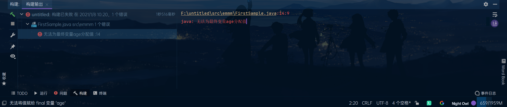
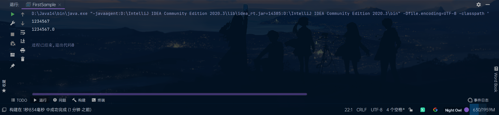
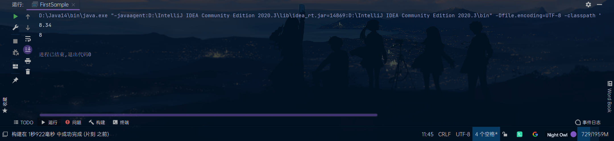
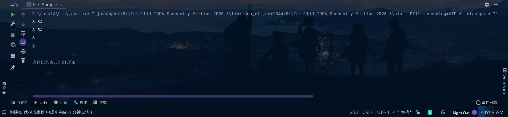
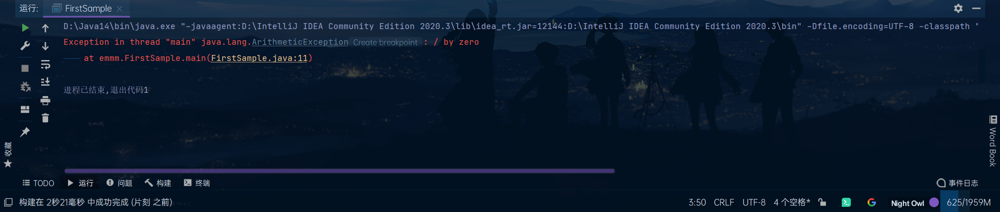
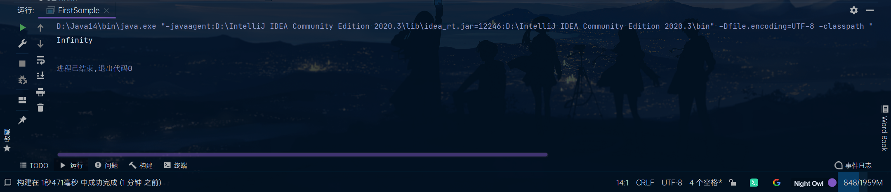
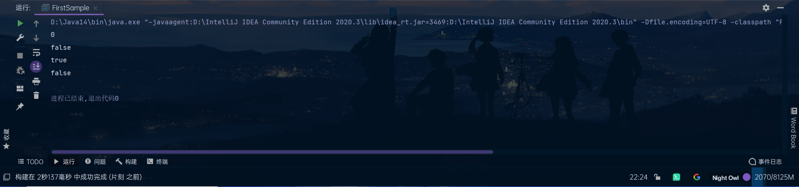

# Learn 《Java核心技术 卷Ⅰ》

[toc]

## 一. 基本数据类型
### int

| int                       | short int     | long                                      | byte      |
| ------------------------- | ------------- | ----------------------------------------- | --------- |
| -2147483648 至 2147483647 | -32768至32767 | -9223372036854775808至9223372036854775807 | -128至127 |

### float&double
| float                 | double                           |
| --------------------- | -------------------------------- |
| 1.4E-45至3.4028235E38 | 4.9E-324至1.7976931348623157E308 |

此外，浮点型还有三个特殊值：

- 正无穷大

- 负无穷大

- NaN(It means "Not a number")

他们所对应的常量分别是：

- ```java
	Double.POSITIVE_INFINITY
	```

- ```java
	Double.NEGATIVE_INFINITY
	```

- ```java
  Double.NaN
  ```
### char

字符型。似乎没什么可说的

### 注意：

长整型后缀L(For example:4000000000L)，十六进制前缀0x(For example:0xCAFE)，八进制前缀0(For example:010)

如果我想定义一个浮点型值为2，怎么办？

```java	
float a = 2;
```

这样是不规范的，因为2会被认为是整型数据，所以会进行一次类型转换，因此，应该这样写：

```java
float a = 2.0;
```


## 二.变量与常量

### 变量声明与初始化

```java
类型 变量名 = 值;
```

### 常量声明与初始化

格式与变量的相同，不过多加个关键字`final`

```java
final 类型 常量名 = 值;
```

C、C++可以使用const关键字来声明常量（C亦可使用#define），虽然Java也有保留字const，但目前并未使用，所以必须使用final关键字

### 区别

变量可以再次被赋值，如：

```java
public class HowOldAmI {

    public static void main(String[] args) 
    {
        int age = 14;
        System.out.println("I`m " + age + " years old now.");

        age = 15;
        System.out.println("Next year,I`ll be "+ age + " !");
    }
}
```

如果把第五行改成这样，使age成为常量并再次编译的话：

```java
final int age = 14;
```

Java虚拟机就会报错：



这也就是常量设计的意义，因为有些重要的东西是不能改变的（如我国的领土面积），为了防止在程序中不小心改变了它们的值，于是有了这种常量的设计

### 枚举类型

 有时，变量的取值只在一个集合内，如服装的尺寸。为了表示这些变量，我们可将尺寸编码设为S、M、L、X，但这样很容易出错，因此有了枚举类型。

比如，可以定义一个这样的枚举类型：

```java
enum Size { SMALL, MEDIUM, LARGE, EXTRA_LARGE}
```

于是，我们可以定义一个这样的变量：

```java
Size s = Size.SMALL;
```

其实也可以这样：

```java
var i = Size.MEDIUM;
```

这样可以省略左边部分的重复书写，这个在说到面向对象时再说

## 三.运算符

### 数值转换

比如我们需要把一个int转成float，只需这样：

```java
public class IntToFloatTest {

    public static void main(String[] args) 
    {
        int a = 1234567;

        float b = a;

        System.out.println(a);

        System.out.println(b);
    }
}
```

结果如下：



下面说下强制转换。从这个名字就看得出来，是强制的类型转换。那为啥要强制转换呢？举个例子：

> 有一个100mL的大烧杯和一个50mL的小烧杯
>
> 小烧杯无论装多少水，倒进大烧杯中总是不会溢出来
>
> 但是大烧杯向小烧杯中倒水就不一定了

类型转换也一样，int就像是那个小烧杯，float就像那个大烧杯，int转float肯定没问题，但反过来就不一定了

但有的时候就是要这样转换！所以就有了强制转换，按照书上的定义，`可能损失信息的转换要通过强制转换来完成`。丢失什么信息呢？请看下面的这个程序：

```java
public class DoubelToInt {

    public static void main(String[] args) 
    {
        double a = 8.34;

        int b = (int) a;

        System.out.println(a);

        System.out.println(b);
    }
}
```

结果如下：



原来是把小数点后的部分截掉了~如果你想用四舍五入的话，就需要用到`java.lang.Math.round`了。演示如下：

```java
import java.lang.Math;

public class DoubelToInt2 {

    public static void main(String[] args)
    {
        double a = 8.34;
        double b = 8.54;

        int c = (int) Math.round(a);

        int d = (int) Math.round(b);

        System.out.println(a);

        System.out.println(b);

        System.out.println(c);

        System.out.println(d);
    }
}
```

结果如下：



这样就可以四舍五入进行转换了


### 算数运算符

| 名称 | 用法 |  意义  |
| :--: | :--: | :--: |
| + | a+b | a与b的和 |
| - | a-b | a与b的差 |
| * | a*b | a与b的积 |
| / | a/b | a与b的商 |
| % | a%b | a与b的余数 |

#### 注意

0不能作为除数。如果一个整型与0相除，如这个：

```java
public class WhatWillHappen {

    public static void main(String[] args) 
    {
        System.out.println(5 / 0);
    }
}
```

会这样：



Java虚拟机会抛出异常`ArithmeticException`，有关异常的部分后面再说

如果让一个浮点数与0相除呢？

```java
public class WhatWillHappen2 {

    public static void main(String[] args) 
    {
        System.out.println(5.1 / 0);
    }
}
```

会这样：



它说结果是正无穷大

按照书上说，浮点数与0相除结果可能是无穷大和NaN（比如用0.0 / 0的结果就是NaN）

#### 更高级的数学运算

|  名称  |  方法  |
| :----: | ---- |
|  乘方  | pow() |
| 平方根 | sqrt() |
| 三角函数   | sin()、cos()、tan() |
| 对数和它的反函数   | exp()、log()、log10() |
| π   | PI |
| e   | E |

使用例：

```java	
import java.lang.Math;

public class MathTest {

    static int a = 4;

    public static void main(String[] args) 
    {
        System.out.println(Math.pow(a,2));

        System.out.println(Math.sqrt(a));

        System.out.println(Math.sin(a));

        System.out.println(Math.cos(a));

        System.out.println(Math.tan(a));

        System.out.println(Math.exp(a));

        System.out.println(Math.log(a));

        System.out.println(Math.log10(a));

        System.out.println(Math.PI);

        System.out.println(Math.E);
    }
}
```

输出结果如下：


如果觉得Math前缀麻烦，可以把第1行改成这样：

```java	
import static java.lang.Math.*;
```

于是你的程序可以变成这样：

```java
import java.lang.Math.*;

public class MathTest2 {

    static int a = 4;

    public static void main(String[] args) 
    {
        System.out.println(pow(a,2));

        System.out.println(sqrt(a));

        System.out.println(sin(a));

        System.out.println(cos(a));

        System.out.println(tan(a));

        System.out.println(exp(a));

        System.out.println(log(a));

        System.out.println(log10(a));

        System.out.println(PI);

        System.out.println(E);
    }
}
```

是不是方便多了？这里使用了静态导入，有关部分后面再说


### 其它数字运算符

#### 结合赋值和运算符

我们经常遇到需要给一个变量做一些计算，然后再赋给它的情况，可以这样写：

```java
a = a + 4;
```

但实际上还能更精简一些：

```java	
a += 4;
```

以上两行代码是等价的

这里值得一提的是：

```java
a += 3.5;  // 假设a为整型
```

会是什么结果？

```java
public class IDontKonwHowToNameThisClass {

    public static void main(String[] args)
    {
        int a = 2;

        a += 3.5;

        System.out.println(a);
    }
}
```


这说明什么？

说明Java实际做的运算是它：

```java	
a = (int)(a + 3.5);
```

往下推一步：

```java
a = (int)(5.5)
```

所以就有`a等于5`

其它的基本数学运算也有这种运算符：

| 基本数学运算符 | 对应的结合赋值运算符 |
| :------------: | :------------------: |
| + | += |
| - | -= |
| * | *= |
| / | /= |
| & | &= |

#### 自增、自减运算符

我们经常遇到需要给一个变量加1或减1的情况（如之后会提到的for循环），我们有三种方法使变量值加1或减1

第一种是最基础，也是最繁琐的：

```java
a = a + 1;  // 假设a是一个整型变量
```

第二个是刚刚学的：

```java
a += 1;
```

第三种是自增运算符，如下：

```java
a++;
```

是不是超简单！（不要忘了最后的分号）

### 关系和Boolean运算符

> 3等于7

看到这句话，你觉得它是对的还是错的？

肯定是*错*的嘛~

> 3小于7

这句呢？

唔。。。是*对*的呢~

就像刚刚这两个例子一样，在计算机中也会用“是”与“否”表达逻辑，在Java中，“是”就是"true"，“否”则是"false"。大部分的现在计算机语言都有这样的设计，实际上，计算机的原理就是这样的01（既真与假）来进行计算的

在Java中，逻辑运算符有`==`,`!=` `<` `>` `<=` `>=`，分别代表等于、不等于、小于、大于、小于等于、大于等于。

再看这句话

> 3小于7且3大于1

是对的吧？

再看这个

> 3大于7或3小于23

是对的还是错的呢？

”3大于7“是错的，”3小于23“的对的，中间用”或“连接，因此只需两个中一个正确就行，所以这句话是对的

”或“、”和“、”非“三种基本的判断在Java中分别表示为`||` `&&` `!` （注意要把逻辑运算符和&&、数学运算符求余&分清楚~）

它们的计算逻辑如下：

- || ：两个值至少一个为true则返回true，反之一律返回false
- &&：两个值都为true时返回true，反之一律返回false
- ！：只有一个参与运算的值，返回与它相反的值

我们通过一段程序加强理解：

```java
public class BooleanTest {

    public static void main(String[] args)
    {
        Boolean a = true;
        Boolean b = false;

        System.out.println(a || b);
        System.out.println(a && b);
        System.out.println(!a);
        System.out.println(!b);
    }
}
```

结果：


### 三元运算符

我们已经学习了如`+` `||`之类的运算符，它们都需要两个参与运算的值，这样的运算符被称为**双元运算符**

还学习了`!`，它只需要一个值参与运算，这样的被称为**一元运算符**

相同的，还有**三元运算符**

它长这样：`? :`

准确说是这样：`条件 ? 语句1 : 语句2`

它的逻辑是，如果条件为真，则走语句1，反之则走语句2

比如这段程序，可以用来返回两数中较小的数：

```java
public class IStillDontKonwHowToNameThisClass {

    public static void main(String[] args)
    {
        int a = 1;
        int b = 2;

        System.out.println(a < b ? a : b);
    }
}
```

### 位运算符

这里不是很好解释，我打算把长安成的《长安成的python之旅》中有关二进制的部分~~白嫖~~拿过来，所以只是先将这些符号列出来

`&` `|` `^` `~` `>>` `<<` `>>>`

分别代表和、或、非、左移、右移、无符号左移

### 运算优先级

跟数学差不多，不管了

## 四.字符串

在Java中，字符串是字符组成的序列，如

```java
String a = "Hello World";
```

字符串可以被拆开、拼接，以及其它奇奇怪怪的操作。Java提供了一些API去实现这些功能

### 字串

也就是把字符串拆开，使用一个叫substring的方法，下面这段程序：

```java
public class SubstringTest {

    public static void main(String[] args)
    {
        String a = "Hello World!";

        String b = a.substring(0,5);

        System.out.println(b);
    }
}
```

它会输出：


注意参数是`substring(0,5)`，两个参数分别是开始和结束的位置，Java语言从0开始计数，最后的5表示到第5个为止，但并不包括第5个

### 拼接

Java也可以把多个字符串拼起来，这个不需要奇奇怪怪的方法，只需要`+`即可

```java
public class StringTest {

    public static void main(String[] args)
    {
        String a = "Hello";
        String b = "World";

        String c = a + " " + b;

        System.out.println(c);
    }
}
```

结果如下：


还要别的比较高级的拼接方法，如`join()`方法，书上的示例：

```java
String all = String.join(" / ","S","M","L","XL");
```

打印结果：


这个方法的源码如下：

```java
/**
 * Returns a new String composed of copies of the
 * {@code CharSequence elements} joined together with a copy of
 * the specified {@code delimiter}.
 *
 * <blockquote>For example,
 * <pre>{@code
 *     String message = String.join("-", "Java", "is", "cool");
 *     // message returned is: "Java-is-cool"
 * }</pre></blockquote>
 *
 * Note that if an element is null, then {@code "null"} is added.
 *
 * @param  delimiter the delimiter that separates each element
 * @param  elements the elements to join together.
 *
 * @return a new {@code String} that is composed of the {@code elements}
 *         separated by the {@code delimiter}
 *
 * @throws NullPointerException If {@code delimiter} or {@code elements}
 *         is {@code null}
 *
 * @see java.util.StringJoiner
 * @since 1.8
 */
public static String join(CharSequence delimiter, CharSequence... elements) {
    Objects.requireNonNull(delimiter);
    Objects.requireNonNull(elements);
    // Number of elements not likely worth Arrays.stream overhead.
    StringJoiner joiner = new StringJoiner(delimiter);
    for (CharSequence cs: elements) {
        joiner.add(cs);
    }
    return joiner.toString();
}
```

可见，它是把多个字符串放在一起（即参数`CharSequence... elements`），两两之间用一个定界符分隔（即参数`CharSequence delimiter`）

<hr>

在Java11中，还添加了`repeat()`方法，用于重复输出一个字符串

如书上的示例代码：

```java
String repeated = "Java".repeat(3);
```

会输出：


### 检测字符串是否相等

可以使用`equals()`检测两个字符串是否相等

看到这一行，你可能会问：“不能用==比较字符串吗？”

如以下示例：

```java
public class EqualsTest {

    public static void main(String[] args)
    {
        String a = "Potato Yao";
        String b = "Potato Yao";

        System.out.println(a == b);

        System.out.println(a.equals(b));
    }
}
```

结果如下：


似乎用`==`也没什么问题呢

但是再看这个：

```java
public class FirstSample {

    public static void main(String[] args)
    {
        String a = "Potato Yao";
        String b = a.substring(0,6);  // It should be "Potato"
        String c = "Potato";

        System.out.println(b == c);  // DOes it mean "Potato == Potato"?

        System.out.println(b.equals(c));  // How about it?Does it mean "Potato == Potato"?
    }
}
```

结果如下：


为什么`==`的结果是false？

这是因为，`==`运算符只是判断两个字符串是否存放在同一位置上，上例中`b`和`c`显然不在一起，因此返回false

所以比较字符串时请使用`equals()`方法

附`equals()`方法源码：

```java
/**
* Compares this string to the specified object.  The result is {@code
* true} if and only if the argument is not {@code null} and is a {@code
* String} object that represents the same sequence of characters as this
* object.
*
* <p>For finer-grained String comparison, refer to
* {@link java.text.Collator}.
*
* @param  anObject
*         The object to compare this {@code String} against
*
* @return  {@code true} if the given object represents a {@code String}
*          equivalent to this string, {@code false} otherwise
*
* @see  #compareTo(String)
* @see  #equalsIgnoreCase(String)
*/
public boolean equals(Object anObject) {
    if (this == anObject) {
        return true;
    }
    if (anObject instanceof String) {
        String aString = (String)anObject;
        if (!COMPACT_STRINGS || this.coder == aString.coder) {
            return StringLatin1.equals(value, aString.value);
        }
    }
    return false;
}
```

### 空串与Null串

空串是长度为0的字符串，如下面这个：

```java
String a = "";
```

Null串是值为Null的字符串，如下面这个：

```java
String b = null;
```

要检查一个字符串是否是空串，只需：

```java
System.out.println(str.length());  // str指需检查的字符串
```

要检查一个字符串是否是Null串，只需：

```java
System.out.println(str == null;  // str指需检查的字符串
```

观察下面的代码示例：

```java
public class FirstSample {

    public static void main(String[] args)
    {
        String a = "";  // 空串
        String b = null;  // Null串

        System.out.println(a.length());

        System.out.println(a == null);

        System.out.println(b.length());

        System.out.println(b == null);

        System.out.println(a.length() == 0 && a == null);

        System.out.println(b.length() == 0 && b == null);
    }
}
```

运行如下：


我们发现，在执行`System.out.println(b.length());`时。报错了，虚拟机停止了程序，报了空指针异常`NullPointerException`，我们把12行和18行（因为18行也有`b.length()`操作）删了重试：



由此可见：

- 不能对Null串执行`length()`，会报空指针错误

- 空串与Null是不同的，空串是长度为0的字符串，它的串长度为0，内容为空；而Null串没有任何值

### 创建字符串

每当我们拼接字符串时，Java虚拟机所作的工作实际上是创建了一个新的字符串，对于简单的程序来说无所谓，但是一旦项目规模较大时，这种方法会变得耗时且浪费空间。使用`StringBuilder`可以避免问题的发生

如此创建一个空的字符串构建器：

```java
StringBuilder builder = new StringBuilder();
```

这样向其中添加内容：

```java
builder.append(str);  // str为要加入的内容
```

下面是几个常用的方法：

- `int length()` 
> 返回构建器或缓冲器中代码单元数量
- `StringBuilder append(String str)`
> 追加一个字符串。返回this
- `void setCharAt(int i, char c)
> 将第i个代码单元设为c
- `StringBuilder insert(int offset, char c)`
> 在offset处插入一个字符并返回this
- `StringBuilder delete(int startIndex, int endIndex)`
> 删除偏移量从startIndex到endIndex-1位置的代码单元并返回this

## 五.String API

1. `char charAt(int index)`
>返回给定位置的代码单元
2. `int codePointAt(int index)`
> 返回从给定位置开始的码点
3. `int offsetByCodePoints(int startIndex, int cpCount)`
>
4. `int compareTo(String other)`
>
5. `IntStream codePoints()`
>
6. `new String(int[] codePoints, int offset, int count)`
>
7. `boolean empty()`
>
8. `boolean blank()`
>
9. `booean equals(Object other)`
>
10. `boolean equalsIgnoreCase(String other)`
>
11. `boolean startsWith(String prefix)`
>
12. `boolean endsWith(String suffix)`
>
13. `boolean indexOf(String str)`
>
14. `boolean indexOf(String str, int fromIndex)`
>
15. `boolean indexOf(int cp)`
>
16. `boolean indexOf(int cp, int fromIndex)`
>
17. `int lastIndexOf(String str)`
>
18. `int lastIndexOf(String str, int fromIndex)`
>
19. `int lastIndexOf(int cp)`
>
20. `int lastIndexOf(int cp, int fromIndex)`
>
21. `int length()`
>
22. `int codePointCount(int startIndex, int endIndex)`
>
23. `String replace(CharSequence oldStr, CharSequence newStr)`
>
24. `String substring(int beginIndex)`
>
25. `String substring(int beginIndex, int endIndex)`
>
26. `String toLowCase()`
>
27. `String toUpperCase()`
>
28. `String trim()`
>
29. `String strip()`
>
30. `String join(CharSequence delimiter, CharSequence... elements)`
>
31. `String repeat(int count)`
>

## 六.输入与输出

### 常用API

出于时间原因，直接用一个代码示例展示：

Fuck,代码出了个空指针异常死活解决不了，先把程序放到这，有时间了再改吧

```java
public class WTF {

    public static void main(String[] args)
    {
        Scanner getUserName = new Scanner(System.in);
        System.out.println("请输入用户名：");
        String username = getUserName.nextLine();

        Console getUserPassword = System.console();
        char[] userPassword = getUserPassword.readPassword("请输入密码：","");  // 推荐使用字符数组保存密码数据
    }
}
```

### 格式化输出

使用`System.out.printf()`方法，具体转换符与C一样，故不赘述